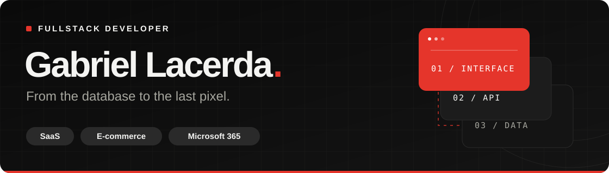

  

  <a href="https://www.gabriel-lacerda.com" target="_blank" rel="noopener noreferrer">Explore my portfolio</a> ·
  <a href="https://www.linkedin.com/in/gabriel-lacerda-nascimento" target="_blank" rel="noopener noreferrer">Connect on LinkedIn</a>

### Building products that people use.

I'm a fullstack developer based in **Brazil**, working with **international teams**. Since 2021, I've built SaaS platforms, commerce integrations, and enterprise applications.

**My focus:** taking SaaS and e-commerce products from idea to production, with clear interfaces, dependable APIs, and thoughtful integrations.

### My everyday stack

  

**Also:** Astro · MySQL · Shopify · Stripe · SPFx · Power Automate

### A few things I've shipped

| Product | What I built |
| :--- | :--- |
| **Investment education SaaS** | Funnel, learning app, and admin dashboard with authentication and payments. |
| **Subscription management** | Shopify integrations and passwordless access for customers aged 55+. |
| **Itaipu Binacional** | Interactive org chart in three languages, connected to SharePoint and Azure AD. |
| **Automated transcription** | An AssemblyAI workflow that reduced turnaround time by **up to 60%**. |

<b>A little more about me</b>

- **Experience:** Peak One Dev · SharePrime · K2M Soluções · Agência Nambbu.
- **Approach:** direct client communication, code review, and AI tools to accelerate delivery.
- **Languages:** Portuguese (native), English (C1), Spanish (intermediate / technical).

---

**Have something in mind? Let's build it together!.
